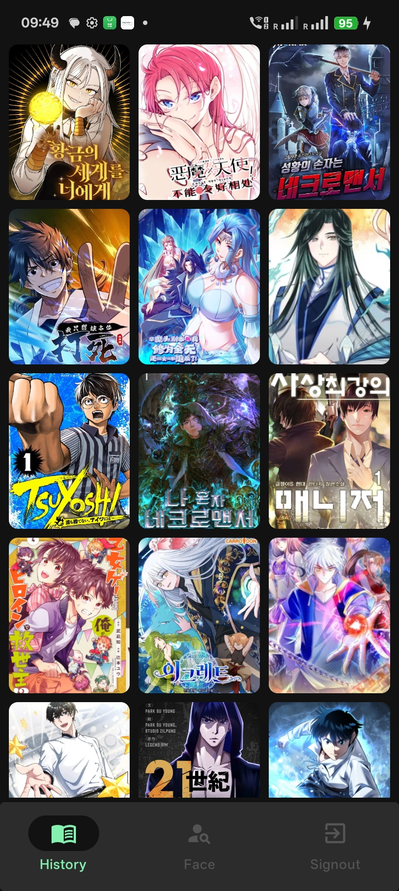
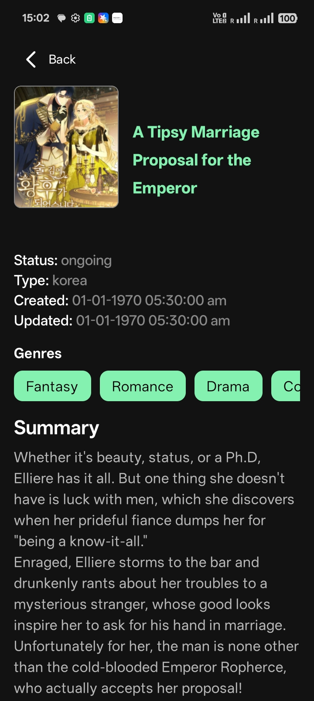
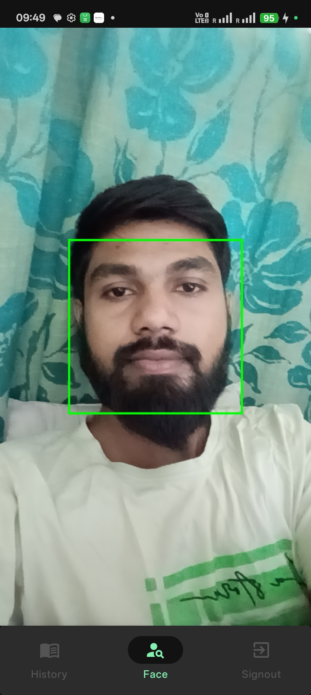
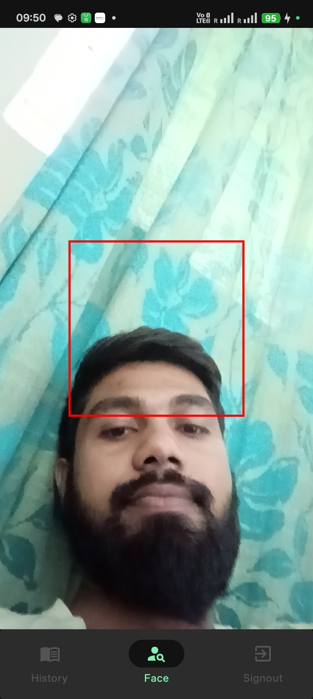
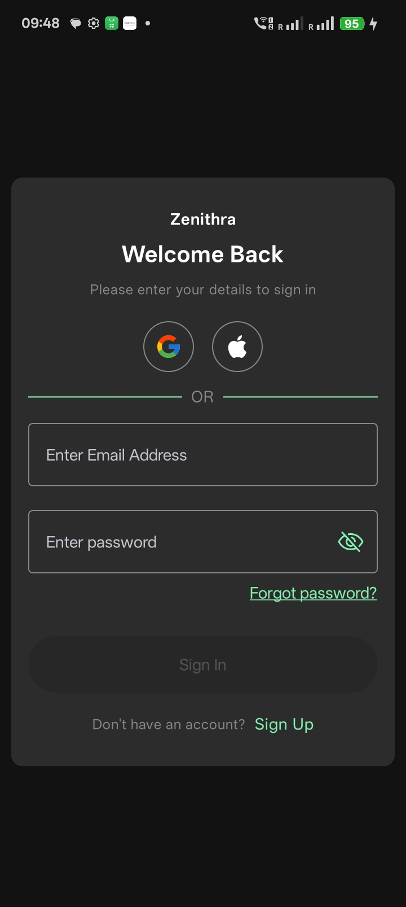
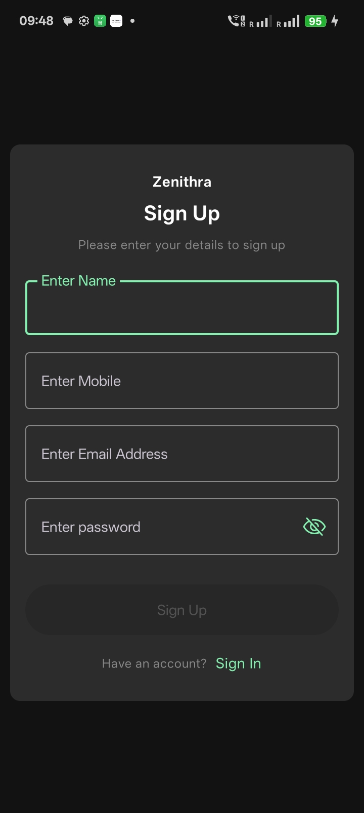
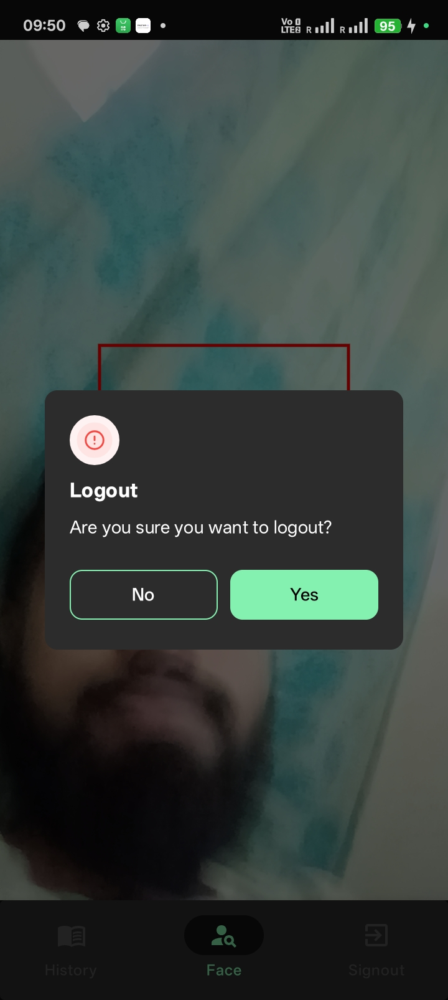
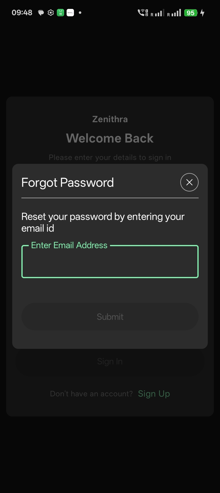
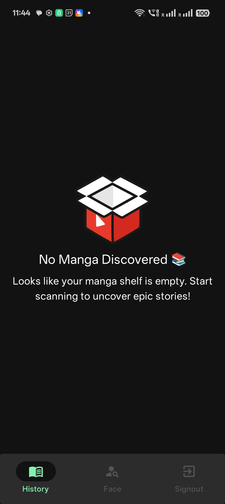

# MangaFace App

MangaFace App is a multi-functional mobile application that allows users to authenticate via email/password or Google Sign-In, view a dashboard of manga content from an external API, and utilize a camera-based feature with ML Kit for real-time face detection. The app also supports dark and light themes.

---

## Table of Contents

- [Overview](#overview)
- [Features](#features)
- [Tech Stack](#tech-stack)
- [Installation](#installation)
- [Usage](#usage)
- [Screenshots](#screenshots)
- [Configuration](#configuration)
- [API Details](#api-details)
- [Contributing](#contributing)
- [License](#license)
- [Contact](#contact)

---

## Overview

**MangaFace App** is designed to merge entertainment with utility:
- **Authentication:** Users can sign up or log in using email, password, mobile number, and name or simply use their Google account.
- **Dashboard:** Displays a list of manga fetched from an external API. Tapping on any manga provides detailed information.
- **Face Detection:** The second bottom navigation uses Android's camera2 API in tandem with ML Kit to perform face detection. It shows a red indicator when no face is detected and green when a face is detected.
- **Signout:** The third bottom navigation contains a signout button to safely log the user out.
- **Themes:** Supports both dark and light themes, adapting to user preference or system settings.

---

## Features

- **Authentication:**
  - **Email & Password Sign-Up/Sign-In:** Allows new users to create an account using their email, password, mobile number, and name.
  - **Google Sign-In:** Quick login using a Google account.
- **Manga Dashboard:**
  - Displays a list of manga items retrieved from an API.
  - Tapping an item navigates to a detailed view with more information about the manga.
- **Face Detection:**
  - Uses Camera2 API with ML Kit for real-time face detection.
  - Red indicator when no face is detected.
  - Green indicator when a face is successfully detected.
- **User Session Management:**
  - Sign out option available from the bottom navigation.
- **Theming:**
  - Built-in dark and light theme support for enhanced user experience in different environments.

---

## Tech Stack

- **Programming Language:** Kotlin (for Android)
- **UI Framework:** Jetpack Compose
- **Authentication:** Firebase Authentication (for email/password and Google Sign-In)
- **Networking:** Retrofit/OkHttp (for manga API integration)
- **Image Loading:** Coil or Glide
- **Face Detection:** Camera2 API combined with ML Kit Face Detection
- **Theming:** Material Design Components for dark and light theme support

## Screenshots

### Dark Mode Screenshots

- **Manga List**
  
  *Dashboard displaying a list of manga items.*

- **Manga Details**
  
  *Detailed view of a selected manga item.*

- **Face Detected (Green Indicator)**
  
  *Camera view with a face detected (green indicator).*

- **Face Not Detected (Red Indicator)**
  
  *Camera view with no face detected (red indicator).*

- **Sign In Screen**
  
  *User sign-in screen.*

- **Sign Up Screen**
  
  *User sign-up screen.*

- **Sign Out Screen**
  
  *User sign-out screen.*

- **Forgot Password Screen**
  
  *Forgot password functionality.*

- **Empty Manga State**
  
  *View when no manga content is available.*

